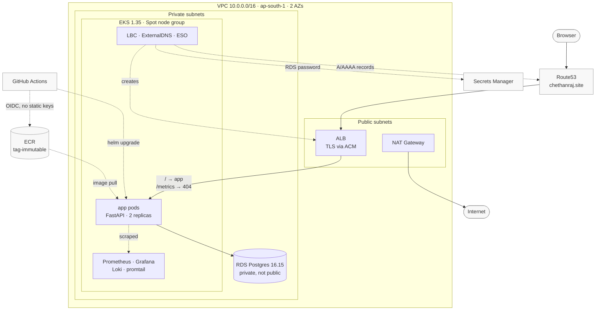

# eks-platform

I built this as a portfolio deliverable: a production-shaped AWS EKS
platform running a FastAPI app backed by RDS Postgres, fronted by an ALB
with TLS, deployed through GitHub Actions, and monitored with Prometheus,
Grafana and Loki. Terraform builds every AWS and Kubernetes resource; three
steps stay manual: pointing the domain's nameservers at Route53, creating
the `production` GitHub Environment, and running `terraform apply` itself.
Staging is destroyed every night to control cost and rebuilt on demand.

The live site is https://chethanraj.site, a server-rendered landing page
that reads and writes a visit counter in Postgres on every load, so a 200
response is a real end-to-end check, not a static page.

## Contents

- [Setup](#setup)
- [Architecture](#architecture)
- [CI/CD](#cicd)
- [Observability](#observability)
- [Security](#security)
- [Verify it works](#verify-it-works)

## Setup

I needed the AWS CLI authenticated as `terraform-admin` under profile `pro`,
Terraform 1.11+, `kubectl`, and `helm`, plus `chethanraj.site` already
registered at Namecheap.

```bash
git clone https://github.com/Chethann-Raj/eks-platform.git
cd eks-platform/terraform/bootstrap
terraform init && terraform providers lock -platform=darwin_arm64 -platform=linux_amd64
terraform apply   # creates the S3 state bucket every other layer reads

cd ../persistent
cp terraform.tfvars.example terraform.tfvars
terraform init && terraform apply
# blocks on ACM's DNS validation until Namecheap delegation propagates -
# point Namecheap's custom DNS at `terraform output hosted_zone_name_servers`
# and confirm with `dig +short NS chethanraj.site` first

cd ../envs/staging
cp terraform.tfvars.example terraform.tfvars
terraform init
GODEBUG=netdns=go terraform apply   # plain apply SERVFAILed on macOS resolving oidc.eks.ap-south-1.amazonaws.com
aws eks update-kubeconfig --name eks-platform-staging --region ap-south-1 --profile pro
```

`terraform.tfvars.example` exists in both envs since `terraform.tfvars` is
gitignored and every variable already has a default. The app itself
deploys through `.github/workflows/deploy.yml` on push to `main`, not a
manual `helm` step.

Before any real teardown, `scripts/pre-destroy.sh` deletes every Ingress
and PVC so the load balancer controller and EBS CSI driver release their
AWS resources first. `scripts/survivor-sweep.sh` checks afterward that no
cluster, RDS instance, NAT gateway, load balancer, EBS volume, or Elastic
IP is left behind.

## Architecture



| Component | Version | Note |
|---|---|---|
| EKS | 1.35 | Standard support, pinned explicitly |
| RDS Postgres | 16.15 | `db.t4g.micro`, 20GB gp3, single-AZ |
| kube-prometheus-stack | 88.6.1 | Prometheus + Grafana |
| Loki | 7.3.0 | SingleBinary, 48h retention, emptyDir |
| promtail | 6.17.1 | DaemonSet shipping pod logs to Loki |
| ExternalDNS | 1.21.1 | Writes the Route53 alias records |
| AWS Load Balancer Controller | 3.5.0 | Provisions the ALB from the app's Ingress |
| External Secrets Operator | 2.10.0 | Pulls the RDS secret into a Kubernetes Secret |
| metrics-server | v0.9.0-eksbuild.7 | EKS addon, backs the app's HPA |

The VPC (`terraform/modules/vpc`) spans `10.0.0.0/16` across two AZs.
Public subnets `10.0.0.0/24`/`10.0.1.0/24` hold the ALB, private subnets
`10.0.10.0/24`/`10.0.11.0/24` hold the EKS nodes and RDS. One NAT gateway
covers both AZs, an AZ-level SPOF that saves about $32/month. A gateway VPC
endpoint for S3 keeps ECR pulls and Loki's writes off the NAT's metered
path, and VPC Flow Logs go to CloudWatch with 3-day retention.

RDS sits in the private subnets only, with `publicly_accessible = false`.
Its security group allows only port 5432 from the EKS cluster security
group. The master password is RDS-managed
(`manage_master_user_password = true`), so RDS rotates it in Secrets
Manager on its own schedule rather than Terraform's.

EKS is pinned to standard support with `upgrade_policy.support_type =
STANDARD`, so it can't drift into paid extended support. All addons
(vpc-cni, kube-proxy, coredns, metrics-server, EBS CSI) are pinned
explicitly, and auth goes through EKS Access Entries, not `aws-auth`.

The node group runs Spot instances from `m7i-flex.large`/`c7i-flex.large`
only, the two Free-Tier-plan instance types large enough to be useful
nodes. When I checked, the running cluster had 3 nodes, all
`c7i-flex.large`, kubelet `v1.35.7-eks-cb19647`.

The API endpoint and node group stay reachable from `0.0.0.0/0`, since
GitHub-hosted runners have no fixed IP range to allowlist. The real
boundary is IAM, Access Entries, and RBAC, backed by control plane audit
logging.

The AWS Load Balancer Controller provisions the ALB from the app's
Ingress, ExternalDNS writes the Route53 alias records, and ACM's wildcard
certificate terminates TLS. External Secrets Operator pulls the
RDS-managed secret into a Kubernetes Secret the app mounts hourly.

## CI/CD

`.github/workflows/deploy.yml` runs `test` (pytest, including the
DB-failure regression cases against a monkeypatched connection) before
`deploy`. `deploy` builds the image once, resolves its digest with
`aws ecr describe-images`, and deploys staging by tag. A `production` job
deploys that same resolved digest instead, so production runs the exact
bytes staging's smoke test validated, never a tag that could be re-pushed.

`terraform/envs/production` is fully defined and plans cleanly (78 to add,
0 to change, 0 to destroy). I haven't applied it: it's a second full EKS
cluster and RDS instance running continuously, and the cost isn't
justified for a portfolio build. Deploying into it is gated behind the
`production` GitHub Environment, which carries a required-reviewer rule
(`can_admins_bypass: true`), enforced in the workflow via `github.ref ==
'refs/heads/main' && vars.PRODUCTION_ENABLED == 'true'`, currently unset
so the job renders as skipped. Turning it on would also need:

- A `namespace` variable added to `terraform/modules/addons`, which
  currently hardcodes `"staging"`.
- A permissions policy attached to the `ci_production` IAM role, which
  today has a trust policy only.
- The `PROD_*` repository variables and the `AWS_ACCOUNT_ID` secret the
  job reads, none of which exist yet (checked directly with
  `gh variable list` and `gh secret list`).

It also reuses staging's exact VPC CIDR, which is safe as long as the two
VPCs stay unpeered.

## Observability

kube-prometheus-stack runs Prometheus and Grafana in `monitoring`, with
Prometheus on a 2-day/4GB-capped emptyDir since gp3 is
`WaitForFirstConsumer` and the cluster rebuilds nightly. The app exposes
`/metrics` via `prometheus-fastapi-instrumentator`, scraped by a
ServiceMonitor.

Loki also runs on an emptyDir. Getting that emptyDir to actually exist took
a real debugging pass, written up in `CHALLENGES.md`. A promtail DaemonSet
ships logs to Loki, chosen over Grafana Alloy for config simplicity under
the time available.

Two custom dashboards ship as ConfigMaps labeled `grafana_dashboard: "1"`,
since a UI-built dashboard lives in Grafana's SQLite database on an
emptyDir and wouldn't survive a rebuild.

The platform dashboard's "App targets up" panel queries
`sum(up{job="app"})`, Prometheus's own scrape-health signal for the app's
ServiceMonitor targets.

## Security

Every AWS-facing addon (EBS CSI, ExternalDNS, External Secrets, the load
balancer controller) has its own IRSA role scoped by OIDC `sub` to one
exact service account. No shared roles, no wildcard resources except where
AWS's API has no resource-level permissions at all.

CI never holds a static AWS key. I read both trust policies rather than
assume them. `ci_deploy`'s matches `sub ==
repo:.../eks-platform:ref:refs/heads/main` (or its immutable-ID form), so
any push to `main` can assume it with no approval step.

`ci_production`'s matches `sub ==
repo:.../eks-platform:environment:production`, which GitHub only issues
once the Environment's protection rules are satisfied, so that's the one
real approval gate. I confirmed separately that `main` has no branch
protection (`gh api .../branches/main/protection` → 404).

RDS credentials live in Secrets Manager and reach the pod through an
ExternalSecret into a mounted file, re-read per connection so rotation
needs no pod restart. EKS Secrets are encrypted with a customer-managed
KMS key with rotation on.

`/metrics` is blocked at the ALB by a fixed-response rule ahead of the
catch-all `/`, which would otherwise forward it through; Prometheus
reaches it in-cluster only. Nodes and RDS sit in private subnets, RDS is
not publicly accessible, and ECR is tag-immutable, which digest-based
promotion also relies on.

The Grafana admin password is a `random_password` resource and lands in
Terraform state in plaintext; `sensitive = true` only hides it from CLI
output, mitigated but not eliminated by the state bucket's SSE-S3
encryption and blocked public access.

The KMS key encrypting EKS Secrets is shared across every environment by
design, since a staging-scoped key would keep its alias reserved through
its 30-day deletion window and break the next morning's rebuild.

With `main` unprotected, the `production` Environment's required reviewer
gates who can trigger a deploy, not what code reached `main` first.

## Verify it works

The public endpoint, including the ALB block on `/metrics`:

```bash
curl -s -o /dev/null -w '%{http_code}\n' https://chethanraj.site/
# 200

# curl -I sends HEAD, and Starlette doesn't auto-register HEAD for a route
# declared with @app.get(...). Health checks need GET, not HEAD.
curl -sI -o /dev/null -w '%{http_code}\n' https://chethanraj.site/
# 405

curl -s -o /dev/null -w '%{http_code}\n' https://chethanraj.site/metrics
# 404, blocked at the ALB on purpose

curl -s https://chethanraj.site/api/stats
# {"message":"Hello from eks-platform","visits":70}
```

Querying Loki directly for the app's own logs:

```bash
kubectl -n monitoring port-forward svc/loki 3100:3100 &
curl -sG 'http://localhost:3100/loki/api/v1/query_range' \
  --data-urlencode 'query={namespace="staging"}' --data-urlencode 'limit=3' \
  | python3 -c "import sys,json; d=json.load(sys.stdin)['data']['result']; print('streams:', len(d)); [print(s['stream'].get('pod'), '|', s['values'][0][1][:100]) for s in d[:3]]"
kill %1
# streams: 1
# app-f5f48c5b-9ft9m | INFO:     10.0.11.148:54432 - "GET /healthz HTTP/1.1" 200 OK
```

Confirming Grafana picked up the Loki datasource:

```bash
kubectl -n monitoring port-forward svc/kube-prometheus-stack-grafana 3000:80 &
PW=$(kubectl -n monitoring get secret eks-platform-staging-grafana-admin \
  -o jsonpath='{.data.admin-password}' | base64 -d)
curl -s -u admin:"$PW" http://localhost:3000/api/datasources \
  | python3 -c "import sys,json; [print(d['name'], d['type'], d['url']) for d in json.load(sys.stdin)]"
kill %1
# Alertmanager alertmanager http://kube-prometheus-stack-alertmanager.monitoring:9093/
# Loki loki http://loki.monitoring.svc.cluster.local:3100
# Prometheus prometheus http://kube-prometheus-stack-prometheus.monitoring:9090/
```
